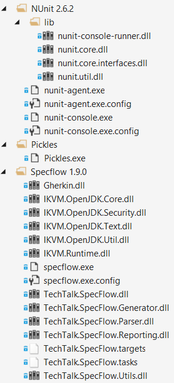
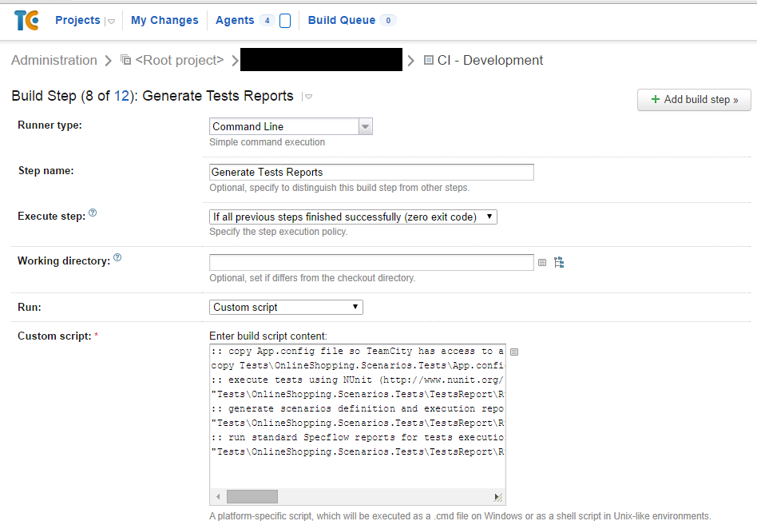

# How to set up Pickles on Teamcity?

Some of the reasons for creating a living documentation system is creating a shared understanding between developers and business people and giving constant feedback. Most business people don't understand code, but with Pickles you can easily provide a more useful test report for them. Such as this one:

**Note**: Here we use NUnit test execution reports, however Pickles supports also MSTest, XUnit and SpecRun. To use another test runners adjust parameters accordingly.

First you need to either add required files to your test project or install required tools on the server where your TeamCity agent is running. The latter is not recommended approach, because it might cause problems if multiple projects use the same agents.
The required tools are: Pickles, Specflow and NUnit (or other test runner).
The following picture presents the list of files that have to be included in the project:

Specflow is complied for .NET 3.5, so if your project uses .NET 4.0, remember to create Specflow.exe.config file with the following content: 

    <?xml version="1.0" encoding="utf-8" ?> 
    <configuration> 
      <startup> 
        <supportedRuntime version="v4.0.30319" /> 
      </startup> 
    </configuration>

Open the configuration of your build project. Add a new build step. 
In Runner Type dropdown pick "Command Line", in Run dropdown pick "Custom script".

Specify a script to run:

    :: execute tests using NUnit 
    "path_to_nunit-console.exe" path_to_project_with_specflow_scenarios /xml:xml_report_output_path 
    :: generate scenarios definition and execution report using Pickles 
    "path_to_Pickles.exe" --feature-directory=directory_containing_all_features --output-directory=Scenarios --test-results-format=nunit --link-results-file= xml_report_output_path  --documentation-format=Dhtml

**Note**: The paths are relative with regard to the solution file.

    :: Sample script:
    :: execute tests using NUnit 
    "Tests\OnlineShopping.Scenarios.Tests\TestsReport\Runners\NUnit 2.6.2\nunit-console.exe" Tests\OnlineShopping.Scenarios.Tests\OnlineShopping.Scenarios.Tests.csproj /xml:TestsResult.xml 
    :: generate scenarios definition and execution report using Pickles 
    "Tests\OnlineShopping.Scenarios.Tests\TestsReport\Runners\Pickles\Pickles.exe" --feature-directory=Tests\OnlineShopping.Scenarios.Tests --output-directory=Scenarios --test-results-format=nunit --link-results-file=TestsResult.xml --documentation-format=Dhtml

Configure a new report tab:

* Open TeamCity web app. Go to Administration -> Integrations -> Report tabs.
* Click "Create new report tab" button.
* Specify the name of the new tab and location of the start page in your rep.

  
**Note**: The path of the start page is relative to the Teamcity artifacts directory.

**Note**: To configure new Report Tabs you need to be a TeamCity administrator.
